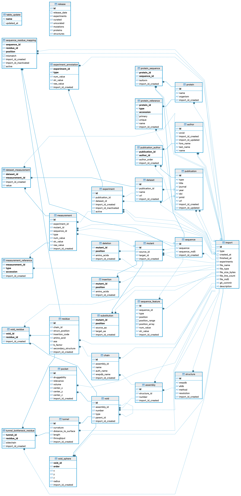
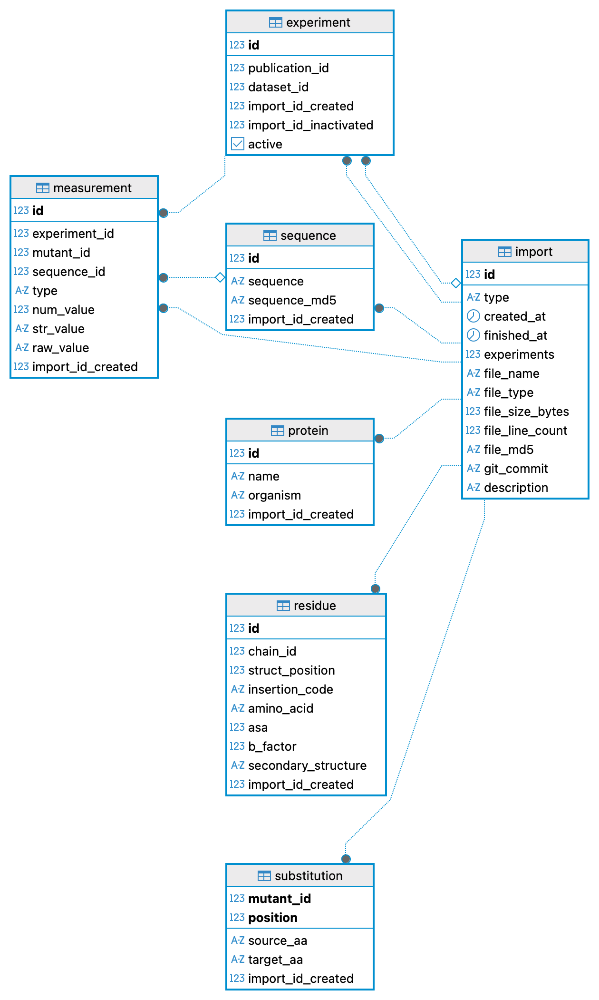

# 🧬 Protein Stability & Mutation Explorer

> Exploring the impact of protein mutations through data engineering, machine learning, and interactive visualization.

⚠️ **This project is still a work in progress (WIP).**  
The goal is to progressively build an end-to-end platform combining:
- biological data processing,
- protein structure exploration,
- machine learning,
- modern data tooling,
- and interactive scientific visualization.

---

# 🎯 Project Goal

Protein mutations can significantly impact protein stability and function.  
This project aims to build a small platform capable of:

- ingesting and transforming protein mutation datasets,
- engineering biologically relevant features,
- training ML models to predict mutation impact,
- visualizing proteins and mutations in 3D,
- and providing an interactive interface to explore predictions.

The project is intentionally designed as a full-stack scientific AI project rather than a simple notebook experiment.

---

# 🧪 Scientific Context

Proteins are highly structured biological molecules whose stability depends on complex physical and chemical interactions.

Even a single amino acid mutation may:
- destabilize a protein,
- alter its folding,
- impact enzymatic activity,
- or modify interactions with other molecules.

Predicting mutation impact is therefore an important challenge in:
- drug discovery,
- protein engineering,
- biotechnology,
- and computational biology.

# Database schema

The project uses a PostgreSQL version of FireProtDB. (https://loschmidt.chemi.muni.cz/fireprotdb/download/)

Main relational structure:


Subdivision of the schema:


```markdown
# Mutation-Explorer

Mutation-Explorer is a data exploration application for protein mutations based on FireProtDB.

The project builds an analytical pipeline from the original FireProtDB PostgreSQL database to a lightweight DuckDB analytical database consumed by a Streamlit application.

## Architecture

```

FireProtDB SQL dump
|
v
PostgreSQL (Docker)
|
| dbt: fireprotdb_dbt
v
Staging tables (PostgreSQL)
|
| Export selected tables
v
Parquet files
|
| dbt: protein_stability_dbt
v
DuckDB analytical database
|
v
Streamlit application

````

---

# Installation

## 1. Clone the repository

```bash
git clone <repository_url>

cd Mutation-Explorer
````

---

## 2. Create the Python environment

Create and activate a virtual environment:

```bash
python -m venv .venv

source .venv/bin/activate
```

Install the required Python packages:

```bash
pip install dbt-core dbt-postgres dbt-duckdb duckdb streamlit pandas pyarrow scikit-learn
```

---

## 3. Start PostgreSQL

FireProtDB is stored in PostgreSQL running inside Docker.

Start the database:

```bash
cd docker

docker compose up -d
```

Check that the container is running:

```bash
docker ps
```

Database configuration:

```
host: localhost
port: 5432
database: fireprotdb
user: fireprot
password: fireprot
```

---

# Initial project setup

This step is only required:

* for a new installation;
* after replacing the FireProtDB dump;
* after recreating the PostgreSQL database.

Run:

```bash
python data_pipeline/scripts/init_pipeline.py
```

This command executes the complete data pipeline:

1. Restore the FireProtDB PostgreSQL dump.
2. Build staging tables using dbt.
3. Export required staging tables to Parquet.
4. Build the DuckDB analytical database.

After completion, the main generated files are:

```
data/
├── intermediate/
│   └── exports/
│       ├── stg_mutations.parquet
│       └── stg_proteins.parquet
│
└── ml/
    └── dev.duckdb
```

---

# Updating the data pipeline

When dbt models are modified or PostgreSQL data changes, rebuild the analytical database with:

```bash
python data_pipeline/scripts/update_data.py
```

This command:

1. Rebuilds PostgreSQL staging models.
2. Re-exports staging tables.
3. Rebuilds DuckDB.

Unlike the initial setup, this command does not restore the database dump.

---

# Running the application

Once DuckDB is up to date, start the Streamlit application:

```bash
streamlit run app/frontend/streamlit_app.py
```

The application directly reads:

```
data/ml/dev.duckdb
```

No PostgreSQL or dbt execution is required to launch the application.

---

# Checking the DuckDB database

To list available tables:

```python
import duckdb

conn = duckdb.connect("data/ml/dev.duckdb")

print(conn.execute("SHOW TABLES").fetchall())
```

Expected tables:

```
stg_mutations
stg_proteins
int_mutation_features
int_proteins
mart_ml_dataset
mart_proteins
```

---

# Project structure

```
Mutation-Explorer/
│
├── app/
│   ├── frontend/
│   │   └── streamlit_app.py
│   └── backend/
│
├── data/
│   ├── raw/
│   │   └── fireprotdb_dump/
│   ├── intermediate/
│   │   └── exports/
│   └── ml/
│       └── dev.duckdb
│
├── data_pipeline/
│   ├── fireprotdb_dbt/
│   ├── protein_stability_dbt/
│   └── scripts/
│       ├── restore_fireprotdb.sh
│       ├── export_from_postgres.py
│       ├── build_duckdb.py
│       ├── init_pipeline.py
│       └── update_data.py
│
├── docker/
│   └── docker-compose.yml
│
└── ml/
    ├── notebooks/
    ├── training/
    └── models/
```

```
```
